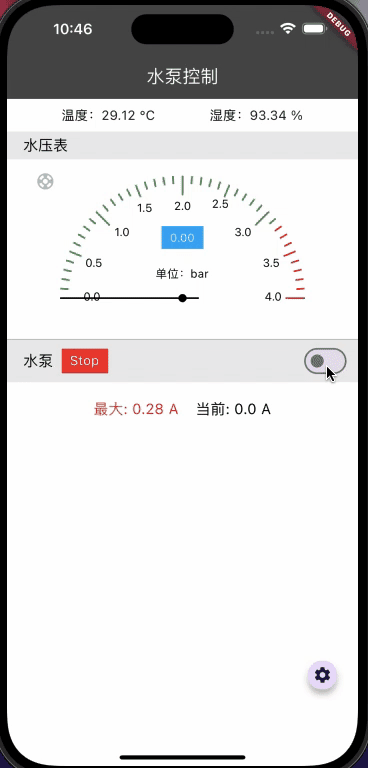
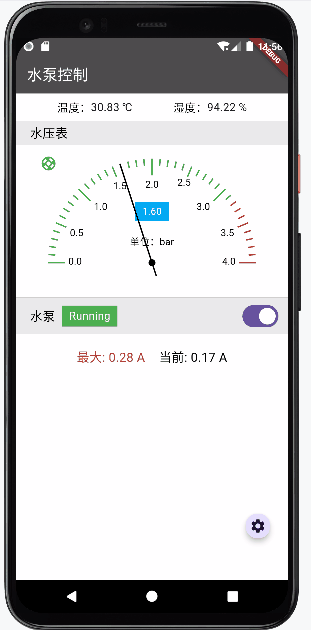
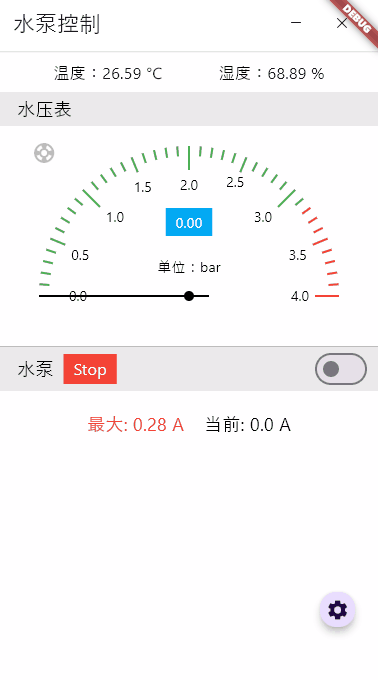

# Flutter 实例展示

## 水泵控制 App
1. 动态仪表盘：反应压力变化的动画效果
2. 内置一个 HttpServer 模拟与服务器通信
3. Provider 状态管理
4. 支持 IOS、macOS、Android、Windows 四个平台

---

### IOS 模拟器效果

---

### macOS 效果

---

### Android 模拟器效果

---

### Windows 10效果

----

### 附源码，欢迎各位大神的指教
### 更多的展示，等待更新 😊

### 联系方式
邮箱: [qq2383@126.com](mailto:qq2383@126.com)
